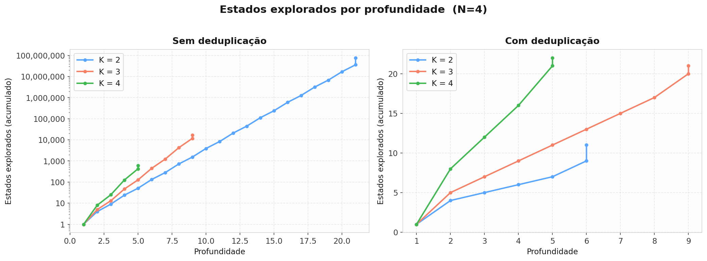
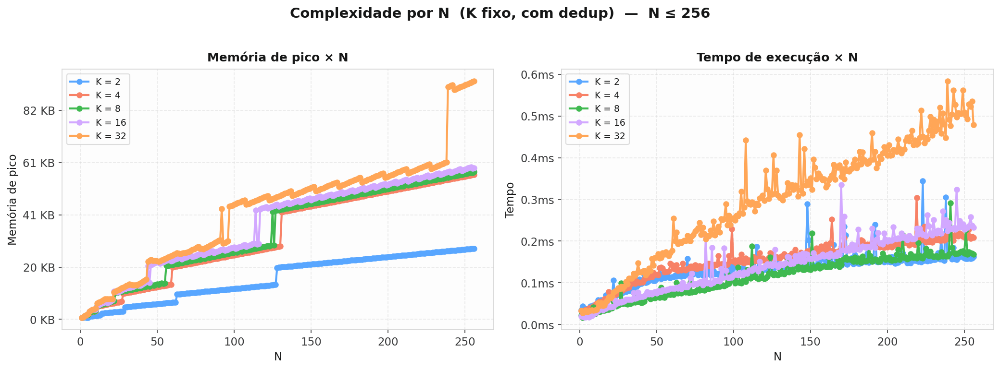
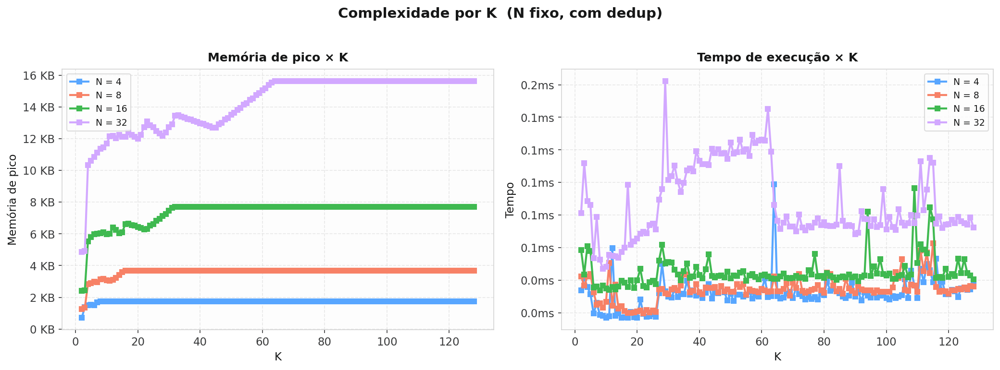

# Busca em Largura no Problema dos Missionários e Canibais: Uma Análise de Complexidade

## 1. Introdução

O problema dos missionários e canibais é um clássico da inteligência artificial e da teoria da busca. Na formulação original, três missionários e três canibais precisam atravessar um rio usando um barco com capacidade para duas pessoas, respeitando a restrição de que os canibais nunca podem superar em número os missionários em nenhum dos lados da margem — caso contrário, os missionários seriam devorados.

Neste trabalho, generalizamos o problema ao parametrizar o número de pares missionário-canibal como N e a capacidade do barco como K. O objetivo é estudar como essas duas variáveis afetam a complexidade da busca: o número de estados explorados, o consumo de memória, o tempo de execução e a profundidade da solução ótima. A busca em largura (BFS) é utilizada por garantir que a primeira solução encontrada possui o menor número de movimentos possível.

No total foram feitos 43068 testes, observou-se que para $K = 2$ foram encontradas soluções apenas para $N = 1, N = 2 \text{ e } N = 3$, para $K = 3$, encontrou-se solução para $N = [1...5]$.
## 2. Metodologia

### 2.1. Formulação do Problema

O espaço de estados é definido pela tripla (lado, C, M), onde:
- **lado** $\in \{0, 1\}$ indica em qual margem o barco está (0 = margem de origem, 1 margem de destino);
- **C** $\in \{0, ..., N\}$ é o número de canibais na margem de destino;
- **M** $\in \{0, ..., N\}$ é o número de missionários na margem de destino.

O estado inicial é (0, 0, 0): todos os N missionários e N canibais estão na margem de origem, juntamente com o barco.

O estado final é (1, N, N): todos estão na margem de destino.

### 2.2. Função Sucessora

A cada passo, o barco transporta entre 1 e K pessoas da margem onde ele se encontra para a outra. Os pares (m, c) de missionários e canibais embarcados satisfazem:

1. $m + c \geq 1$ e $m + c \leq K$;
2. Em ambas as margens, após a travessia, o número de missionários deve ser maior ou igual ao de canibais, a menos que não haja missionário algum naquela margem;
3. Adicionalmente, adotamos a restrição de que dentro do próprio barco o número de missionários também deve ser maior ou igual ao de canibais, exceto quando não há missionários a bordo. Essa interpretação é mais conservadora do que a formulação clássica e elimina estados que seriam fisicamente inválidos.

### 2.3. Deduplicação por Tabela Hash

Durante a BFS, cada estado gerado é representado por uma chave de 64 bits e inserido em um conjunto hash. Antes de enfileirar um novo estado, verifica-se se ele já foi visitado. Essa técnica é fundamental por dois motivos:

- Correção: sem deduplicação, a BFS pode revisitar os mesmos estados indefinidamente em ciclos, nunca terminando quando não existe solução para a combinação (N, K).
- Eficiência: mesmo quando a solução existe, a deduplicação elimina uma fração significativa dos estados redundantes, reduzindo tanto o tempo quanto o consumo de memória.

### 2.4. Configurações testadas e Métricas

Os experimentos foram conduzidos variando:

- K de 1 a 128 em incrementos de 1;
- N de 1 a 256 em incrementos de 1, e em seguida em progressão exponencial até o consumo de memória exceder 4 GB.

Para cada configuração (N, K, dedup $\in \{0, 1\}$), as seguintes métricas foram coletadas:

- Número de estados explorados e número de estados pulados por deduplicação, registrados a cada nova profundidade alcançada;
- Tempo de execução (wall clock);
- Memória de pico (maximum resident set size);
- Número de travessias mínimas até a solução (profundidade da BFS).

O objetivo central da análise é caracterizar empiricamente como a complexidade da BFS cresce com N e K, evidenciar o impacto da deduplicação e identificar os regimes em que o problema se torna intratável.

## 3. Resultados

### 3.1. Importância da Deduplicação

Para ilustrar o impacto da deduplicação, fixamos N = 4 e comparamos as execuções com K $\in \{2, 3, 4\}$, plotando o número acumulado de estados explorados no eixo Y conforme a profundidade avança no eixo X.

A hipótese central é que barcos menores produzem soluções mais profundas — mais idas e vindas são necessárias para atravessar todos — enquanto barcos maiores produzem soluções rasas, mas com maior fator de ramificação em cada nível. Sem deduplicação, os estados repetidos se acumulam exponencialmente em ambos os casos, tornando a busca intratável mesmo para N moderados. Com deduplicação, o número de estados únicos é limitado pela cardinalidade do espaço de estados, que cresce polinomialmente em N para K fixo.

Para evidenciar o impacto da deduplicação, fixamos N = 4 e comparamos as execuções com $K \in \{2, 3, 4\}$ registrando o número acumulado de estados explorados a cada profundidade atingida. A Figura 1 apresenta esse resultado: o painel esquerdo corresponde à execução sem deduplicação e o painel direito à execução com deduplicação.



Sem deduplicação, o número de estados cresce de forma acentuada a cada nível da árvore, pois os mesmos estados são reenfileirados repetidamente através de caminhos distintos. Com deduplicação, as curvas crescem de forma muito mais contida e convergem rapidamente, refletindo o fato de que o espaço de estados únicos é finito e limitado por $(N+1)^2 × 2.$ Esse contraste justifica a adoção obrigatória da tabela hash em qualquer execução prática: além de reduzir o consumo de memória e tempo por ordens de magnitude, ela é a única garantia de terminação nos casos sem solução.

### 3.2. Complexidade por N (K fixo)

Para avaliar como a complexidade escala com o tamanho do problema, fixamos alguns valores representativos de K e variamos N no eixo X de até 256, plotando o tempo de execução e a memória de pico no eixo Y. A memória de pico é extraída do maior valor de ```memory_usage``` reportado durante a execução, que reflete o momento em que a fila atinge sua largura máxima.



Observa-se que conforme esperado, tanto a memória quanto o tempo de execução crescem à medida que o N também cresce para um mesmo K. Isso mostra que é necessário mais viagens de barco para resolver o problema, uma vez que temos mais "passageiros".

### 3.3. Complexidade por K (N fixo)
Para estudar o efeito isolado da capacidade do barco, fixamos valores representativos de N e variamos K no eixo X.
Nota-se que o pico da memória depende apenas do valor de N, e cresce de maneira linear, tendo complexidade $O(N)$.

O comportamento do tempo de execução mostra um crescimento aparentemente quadrático no tempo de execução para um mesmo N à medida que o K aumenta, ou seja, quanto maior K, maior a ramificação da árvore, e precisa-se de mais tempo para percorrer sua largura, e a complexidade dessa operação é $O(K^2)$.

